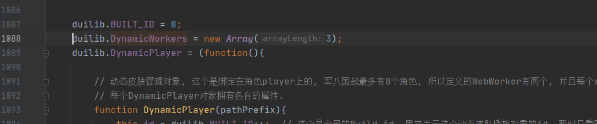
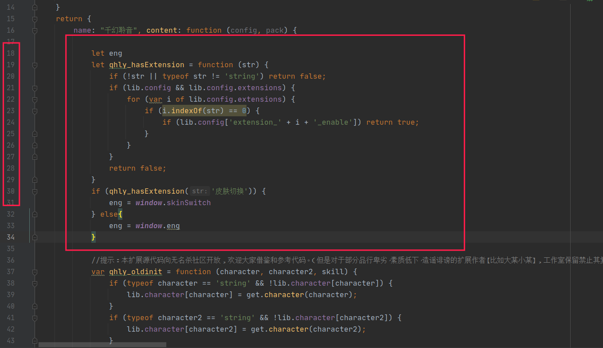
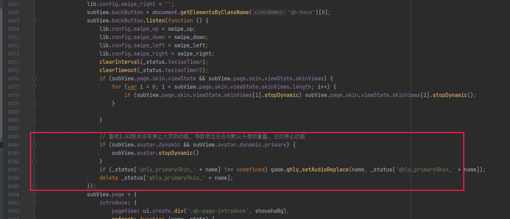
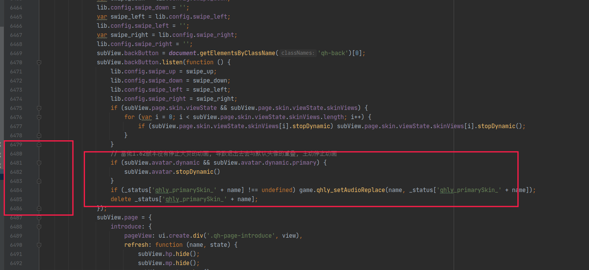
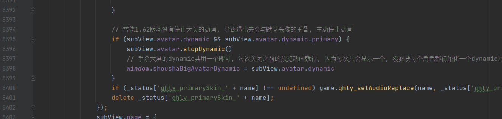
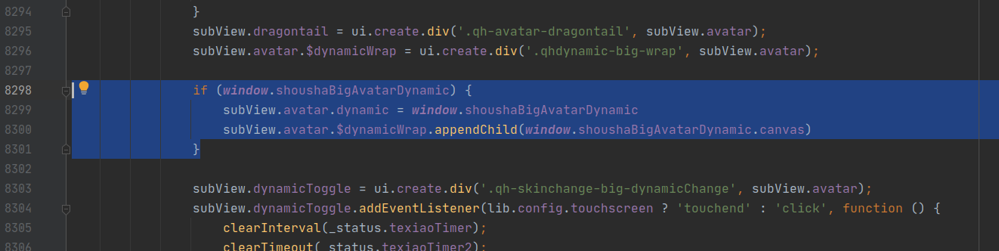

### 皮肤切换使用文档.

#### **说明**

介绍使用文档之前先说明几个问题.

1.  当前扩展只依赖十周年UI, 当前扩展理论上不会和修改UI类的其他扩展发生冲突, 只会和依赖于十周年UI的`dynamicWorker.js`

   文件这些操作动皮的扩展发生冲突.

2. 当前这个扩展是把K佬的`EngEX`插件的动皮部分功能抽离进行魔改. 因此可能暂时不和原

来的`EngEX`扩展兼容, 但是当前扩展是支持原来`EngEX`的动态换肤功能与动态皮肤出框攻击的功能的. 

3. 原本取这个扩展的名字为<<`皮肤切换`>>的原因是因为个人想做个动皮静皮切换的功能, 

但是最近(2022-12-1)了解到雷佬已经基于千幻聆音实现了这个功能, 基于不重复造轮子

的思想, 我就不做这个东西了. 

4. 如果导入本扩展导致崩溃报错想要还原, 只要还原十周年UI备份的2个改动文件, 然后删除本扩展即可. 
4. 真动皮攻击音效问题, 这个放到本扩展下的audio/effect目录下, 名字与待机皮肤相同即可. 这个与eng的音效目录相同.

#### 扩展功能

​	**1. 可视化调整参数**

​	这个扩展当前的功能是能够在游戏中可视化调整动皮的出框和待机参数, 并且保存调整后的参数,

参数的信息保存在插件同级目录的`saveSkinParams.js`, 这里面保存的参数会在加载当前扩展

读取,并覆盖原来十周年UI中`dynamicSkin.js`填写的动皮位置相关参数, 从而实现保存参数的功能. 

如果想要永久修改可以把本地保存的相关参数copy到原来`dynamicSkin.js`. 


如上图所示, 首先打开编辑动皮参数弹窗. 功能分成两栏, 左边为调整动皮待机的参数, 右边为调整动皮出框的参数.

每次要调整对应的参数需要先点击播放待机或者播放出框按钮. 然后下面的修改参数才会生效. 

十周年UI动皮的典型参数如下所示

```js
		武将名:{
			皮肤名:{
				name: "xxx",	//	必★填	骨骼名称，一般是yyy.skel，注意xxx不带后缀名.skel；
				action: "xxx",	//	可删掉	播放动作，xxx 一般是 DaiJi，目前手杀的骨骼文件需要填；
				x: [10, 0.5],	//	可删掉	[10, 0.5]相当于 left: calc(10px + 50%)，不填默认为[0, 0.5]；
				y: [10, 0.5],	//	可删掉	[10, 0.5]相当于 bottom: calc(10px + 50%)，不填默认为[0, 0.5]；
				scale: 0.5,		//	可删掉	缩放大小，不填默认为1；
				angle: 0,		//	可删掉	旋转角度，不填默认为0；
				speed: 1,		//	可删掉	播放速度，不填默认为1；
				hideSlots: ['隐藏的部件'],	// 隐藏不需要的部件，想知道具体部件名称请使用SpineAltasSplit工具查看
				clipSlots: ['裁剪的部件'],	// 剪掉超出头的部件，仅针对露头动皮，其他勿用
				background: "xxx.jpg",	//	可删掉	背景图片，注意后面要写后缀名，如.jpg .png等 
			}
		},
```

当前插件支持修改其中的`x`,`y`,`scale`,`angle`4个参数, 其中出框参数不支持修改角度`angle`, 这两个的实时参数都在调整弹窗有所显示.

点击调整待机或者调整出框会在左侧出现调整位置的十字键, 这是修改上面动皮参数x,y[0, 0.5]右边的比例参数, 弹窗里的x和y的修改是修改x,y[0, 0.5]左边的0px, 这个相当于微调. 参数调整完成点击保存, 保存成功会弹出保存成功的提示.  

**2. 预览spine动画**

如果开启了加入顶部菜单, 可以简单预览一些spine动画, 在这里可以快速查看骨骼的标签, 这个功能是从spine官方的示例demo扒来的,可以查看spine官方库的示例: https://github.com/EsotericSoftware/spine-runtimes/blob/3.8/spine-ts/webgl/example/index.html

上面也有官方更多的spine使用示例. 


要预览这些骨骼只需要把骨骼文件放到扩展目录下的asset文件夹下即可. 可以使用json或者skel格式, 当然骨骼的版本需要无名杀的spine库支持. 

**3. 支持手杀和十周年动皮出框**

要实现上面这种方式, 需要把`dynamicSkin`参数填写正确. 填写示例如下所示. 示例均以何太后为例, 这个角色有假动皮, 手杀真动和十周年真动特效.  可以完整的演示扩展当前支持的出框功能.

参数说明之前一些其他说的. 为了方便管理, 可以在十周年动态骨骼文件夹创建其他文件夹的, 只需要name参数加上完整的文件夹名字就行.


**参数填写详细说明**

**参数增加功能**

12-06添加

现在当攻击时, 当对应的动皮骨骼有多个动作标签时, 可以选择填写多个标签, 攻击时会随机播放一个攻击动画

写法示例: 

```js
caoying:{
    锋芒毕露: {
        name: 'skin_caoying_FengMangBiLou',
        x: [0, 0.3],
        y: [0, -0.13],
        scale: 0.65,
        pos: {
            x: [0,0.7],
            y: [0,0.45]
        },
        gongji: {
            action: ['TeShu', 'GongJi'] // 可以直接指定原来的特殊动作当作另一个攻击动画, 随机从这两个抽取播放
        },
        background: 'skin_caoying_FengMangBiLou_bg.png',
    }
}
```

12-10添加

十周年真动皮典型参数示例

```js
			'评世雕龙': {
				name: '许邵/评世雕龙/daiji',
				x: [0, 0.5],
				y: [0, 0.5],
				teshu: 'play2',  // 触发非攻击技能时播放, (可以改成出框, 默认是原地附近出框, 可能会和其他角色的出框重叠.)
				gongji: {
                    // 攻击位置参数可以不填写, 默认原地出框
					name: '许邵/评世雕龙/chuchang2',
					action: ['gongji', 'jineng']  // 出杀或攻击时随机播放一个动画
				},
				shizhounian: true,  // 标明这是十周年的骨骼, 出场位置和出框默认会在原地, 并且返回也不是位移
				chuchang: {  // 第一回合出场
                    // 攻击参数不用填写
					name: '许邵/评世雕龙/chuchang',
					action: 'play',
					scale: 0.45
				},
				shan: 'play2', // 只有是shizhounian为true时才会播放出闪的动画. 默认play3
				background: '许邵/评世雕龙/skin_Decennial_XuShao_PingShiDiaoLong_bg.png',
                play2: 'play2' // 十周年真动皮会随机播放play2动作, 例如何太后的战场绝版会随机时间播放倒酒动画
			}
```

2023-1-29添加

十周年真动皮有的还有指示线, 可以添加指示线, 参数示例

```js
lvlingqi: {
			'战场绝版': {
				name: '吕玲绮/战场绝版/daiji2',  // 可以直接文件夹带名字
				x: [0, 0.5],
				y: [0, 0.5],
				scale: 1,
				gongji: {
					name: '吕玲绮/战场绝版/chuchang2',
					scale: 0.7,
					action: ['gongji', 'jineng'],  // 现在可以直接填写多个攻击标签, 这样会随机使用一个攻击动作播放
				},
				teshu: 'play2',  // 特殊标签刚刚写错了
				beijing: {
					name: '吕玲绮/战场绝版/beijing',
					scale: 0.4,
					x: [0, 1.2],
					y: [0, 0.5]
				},
				chuchang: {
					name: '吕玲绮/战场绝版/chuchang',
					scale: 0.8,
					action: 'play'
				},
				shizhounian: true,
				// 十周年指示线特效包括shouji和shouji2
				zhishixian: {
					name: '吕玲绮/战场绝版/shouji2',  // 指示线
					scale: 0.8,
					speed: 0.5,
					delay: 0.5,  // 指示线在骨骼攻击多久后出现, 区间[0, 1], 默认0
					effect: {  // 爆炸特效 一般是shouji
						name: '吕玲绮/战场绝版/shouji',  // 指示线
						scale: 0.6,
						speed: 0.7,
						delay: 0.2,  // 在指示线播放多久之后播放爆炸骨骼特效, [0, 0.1]
					}
				}
			}
		},

```


```js
// 写法1: 假动皮, 和原来一样该怎么写就怎么写
耀紫迷幻: {
    name: 'skin_hetaihou_YaoZiMiHuan',
    x: [0, 0.5],
    y: [0, 0.5],
    scale: 0.8,
    background: 'skin_hetaihou_YaoZiMiHuan_bg.png',
}


// 写法2: 假动皮如果想要出框的话, 也是支持的. 因为假动皮没有攻击动作, 所以就算出框也只是播放待机动作
耀紫迷幻:{
    name: 'skin_hetaihou_YaoZiMiHuan',
    x: [0, 0.5],
    y: [0, 0.5],
    scale: 0.8,
    background: 'skin_hetaihou_YaoZiMiHuan_bg.png',
    gongji: true  // 假动皮只要在原本的基础上就可以触发攻击特效, 就是在屏幕中央显示待机动作
}
// 写法3: 假动皮想要出框也可以详细的设置, 就像下面一样. 可以配置出框后的待机大小位置等参数
耀紫迷幻:{
    name: 'skin_hetaihou_YaoZiMiHuan',
    x: [0, 0.5],
    y: [0, 0.5],
    scale: 0.8,
    background: 'skin_hetaihou_YaoZiMiHuan_bg.png',
    gongji: {
        name: 'skin_hetaihou_YaoZiMiHuan',  // name可以是其他骨骼皮肤, 不填则默认是当前皮肤
        x: [0, 0.5],
        y: [0, 0.5],
        scale: 0.6,
    }
}

// 手杀真动皮: 写法1, 手杀的真动皮的标签都是ChuKuang, DaiJi, TeShu, GongJi
蛇蝎为心:{
    name: 'skin_hetaihou_SheXieWeiXin',
    action: 'DaiJi', // 现在这个可写可不写, 会自动识别手杀真动皮.
    x: [-50, 0.5],
    y: [10, 0.1],
    scale: 0.46,
    angle: 27,
    clipSlots: ['wangzuo', 'bu2', 'bu3'],
    background: 'skin_hetaihou_SheXieWeiXin_bg.png',
    skinName: '蛇蝎为心',
}
// 手杀真动皮: 写法2, 像下面这种写法是原来EngEX的真动皮写法, 保留这种写法兼容原来的EngEX参数写法.
蛇蝎为心:{
    name: 'skin_hetaihou_SheXieWeiXin',
    action: 'DaiJi', // 现在这个可写可不写, 会自动识别手杀真动皮.
    x: [-50, 0.5],
    y: [10, 0.1],
    scale: 0.46,
    angle: 27,
    pos: {  // 通过pos参数调整出框后的位置参数
        x: [0,0.8],
        y: [0,0.4]
    }
    clipSlots: ['wangzuo', 'bu2', 'bu3'],
    background: 'skin_hetaihou_SheXieWeiXin_bg.png',
    skinName: '蛇蝎为心',
}
// 手杀真动皮: 写法3,  不通过pos参加指定, 统一通过gongji参数来配置
蛇蝎为心:{
    name: 'skin_hetaihou_SheXieWeiXin',
    // action: 'DaiJi',
    x: [-50, 0.5],
    y: [10, 0.1],
    scale: 0.46,
    angle: 27,
    clipSlots: ['wangzuo', 'bu2', 'bu3'],
    background: 'skin_hetaihou_SheXieWeiXin_bg.png',
    skinName: '蛇蝎为心',
    gongji: {  // 指定播放出框攻击的位置大小参数. 
        x: [0, 0.5],
        y: [0, 0.5],
        scale: 0.8,
    }
}

// 十周年UI动皮, 由于十周年UI动皮复杂, 动作都没有统一在一个骨骼文件中. 所以通过下面几种的方式绕过
// 下面的参数解释: 外层还是原来的写法, 不写action会默认寻找骨骼的第一个动作标签当作待机动作.

// teshu动作解释----- 特殊动作是指代当角色使用非攻击的技能时会播放特殊动作.
// teshu标签可以指定同一个皮肤的其他动作, 直接指定名字, 不填默认是手杀的"TeShu", 当然也可以指定其他骨骼文件的某个动作, 当指定
// 其他骨骼文件后, 就是出框动作了, 见teshu写法2

// gongji动作解释----- 当角色使用攻击(比如出杀,南蛮)等会自动触发攻击动作, 也就是下面gongji标签所指代的
// gongji同样可以简写待机骨骼的gongji标签名字,或者可以指定其他骨骼的gongji动画. 所以可以指定其他角色的gongji动画, 虽然很奇怪

// teshu写法1
战场绝版: {
    name: '何太后/daiji',  // 为了方便管理, 可以像这种写法, 把同一个角色的骨骼文件放在一个目录下, 不过name和背景需要指定目录
    x: [0, 1.55],
    y: [0, 0.3],
    scale: 0.45,
    background: '何太后/skin_hetaihou_zhanchangjueban_bg.png',
    teshu: 'play2',  // 如果是和待机同一个皮肤, 可以直接填写对应的特殊动作标签名字
}

// teshu写法2
战场绝版: {
    name: '何太后战场骨骼/daiji',
    x: [0, 1.55],
    y: [0, 0.3],
    scale: 0.45,
    background: '何太后/skin_hetaihou_zhanchangjueban_bg.png',
    teshu: {
        name:"何太后战场骨骼/chuchang2",
        action: 'gongji',
        scale: 0.7,
        x: [0, 0.5],
        y: [0, 0.5],
    }
}

// gongji写法1
战场绝版: {
    name: '何太后战场骨骼/daiji',
    x: [0, 1.55],
    y: [0, 0.3],
    scale: 0.45,
    background: '何太后/skin_hetaihou_zhanchangjueban_bg.png',
    gongji: 'play2',  // 这种简写 攻击会自动寻找待机皮肤的play2标签在屏幕中央播放, x,y是[0,0.5],scale同待机
}


// gongji写法2
战场绝版: {
    name: '何太后战场骨骼/daiji',
    x: [0, 1.55],
    y: [0, 0.3],
    scale: 0.45,
    background: '何太后/skin_hetaihou_zhanchangjueban_bg.png',
    gongji: {  // 这种就是详细写法了
        name:"何太后战场骨骼/chuchang2",  // 可以指定另外的骨骼, 包括其他角色, 只要路径写对. 
        action: 'gongji',  // action不写是默认播放第一个动作
        scale: 0.7,
        x: [0, 0.5],
        y: [0, 0.5],
    }
}
```


 **调整千幻雷修手杀大屏预览的动皮位置功能**

调整需要打开功能面板,然后点开大屏开始调整. 最后的效果如下所示, 经过这个细微调整可以做到和手杀的预览界面差不多


#### 十周年文件的修改

**1.9.117.2后十周年UI与本体兼容问题**

本体添加了新的文字按钮, 需要在十周年UI extension.js添加下面几行代码


```js
else if (item[1] == 'textbutton') {
								// 1.9.117.2版本添加了文字按钮, 这里需要添加一个分支单独处理文字按钮, 参考本体game.js 26559行
								ui.create.textbuttons(item[0], this, noclick);
							} 
```


因为对十周年UI的文件做了一些修改, 所以要使用需要先导入十周年文件. 需要先备份一下原来的3个文件. 扩展设置页面有提供按钮. 会在原十周年UI目录下创建备份文件夹. 只需要备份一次即可. 

主要只改动 `animiation.js` , `dynamicWorker.js`改动如下.

3 `animiation.js`

改动非常简单.

`APNode`构造方法添加了player参数保存`dynamicSkin.js`的动皮配置参数.


4. `animiation.js`文件,  当场上有8个角色有动皮时, 千幻雷修的手杀大屏也需要实例化一个DynamicPlayer对象, 由于原十周年定义最多有8个. 所以可能需要改动这个worker的数量, 让最多有3个worker工作. 

   

5. `dynamicWorker.js`完全重写

 

#### 扩展兼容问题

本人测试时使用了特效测试, 手杀UI, 无名杀补丁,原版千幻聆音都没有出现问题. 理论上UI扩展,武将扩展都不会出现兼容问题.

`EngEX扩展暂时还没有适配`

雷佬的千幻聆音雷修版本,个人今天简单使用了下,  已经简单的做了适配, 主要修改千幻聆音`extension.js`的如下部分

因为千幻聆音雷修依赖EngEX扩展的动皮出框, 所以需要替换全局eng的引用. 

需要在扩展的开头加上下面的替换原eng的引用即可. 

因为本人扩展是基于Engex的, 所以两者的动皮出框接口都是相同, 下面替换eng为公用的`dynamicExt`

**第一处:** 

```js
let qhly_hasExtension = function (str) {
    if (!str || typeof str != 'string') return false;
    if (lib.config && lib.config.extensions) {
        for (var i of lib.config.extensions) {
            if (i.indexOf(str) == 0) {
                if (lib.config['extension_' + i + '_enable']) return true;
            }
        }
    }
    return false;
}
if (qhly_hasExtension('皮肤切换')) {
    window.dynamicExt = window.skinSwitch
} else{
    window.dynamicExt = window.eng
}
```



**第二处,** 因为雷佬是通过`game.qhly_hasExtension('EngEX')`函数来判断eng扩展的,

所以全局替换 `game.qhly_hasExtension('EngEX')`  -> `dynamicExt` , 这样并不会改变原来的功能判断.

**第三处:** 这里是为了解决重复初始化同一角色的问题, 在大概200多行的地方

```js
if (this.dynamic) {
    if (this.dynamic.primary) this.stopDynamic(true, false)
    if (this.dynamic.deputy) this.stopDynamic(false, true)
    // this.stopDynamic();
}
```


**第四处**

修改`game.qhly_changeDynamicSkin = function (str, name, character, character2) {  `...}函数, 这个函数是用来更换动皮的.


如上所示, 添加修改了两处, 第一个疑似雷修1.62版本的bug, 我这边在双将模式下,修改动皮皮肤, 会被千幻原来的静皮覆盖, 所以这里去掉静皮. 

```js
 // 修改 修改完动皮后, 取消原来的背景
if (get.itemtype(node) === 'player' && dynamicExt) {
    let ava = bool1 ? 'primary' : 'deputy'
    let obj = node.getElementsByClassName(ava + "-avatar")[0];
    obj.style.backgroundImage = null
}
```


第二个: 在播放动皮的时候添加一个参数, 标明这时预览手杀大页的动皮. 

```js
qhlxBigAvatar: node.classList.contains('qh-shousha-big-avatar')
```

**第5处和第6处**

都是一样的原因, 疑似雷修1.62版本的bug. 当大图预览动皮的时候, 返回到原来的界面播放动皮会失败, 这时因为原来的动皮

播放没有停止. 

```js
if (subView.avatar.dynamic && subView.avatar.dynamic.primary) {
    subView.avatar.stopDynamic()
}
```

代码位置大概在两处, 十周年UI预览和手杀UI大图预览页面的返回按键监听函数添加





第7处: 直接替换`game.playShoushaAvatar`函数

```js
game.playShoushaAvatar = function (node) {
    if (lib.config['extension_千幻聆音_qhly_shoushaTexiao'] && game.qhly_hasExtension('皮肤切换')) {
        // 留空表示可以往下走.
    } else if (!lib.config['extension_千幻聆音_qhly_shoushaTexiao'] || !game.qhly_hasExtension('EngEX') || !lib.config['extension_EngEX_SSSEffect']) return;
    var mainPlayer = document.getElementById('mainView');
    if (!mainPlayer || !node.dynamic || !node.dynamic.primary || node.dynamic.primary.name != _status.currentTexiao) {
        clearInterval(_status.texiaoTimer);
        clearTimeout(_status.texiaoTimer2);
        return;
    }
    if (game.qhly_hasExtension('皮肤切换')) {
        node.isQhlx = true // 表示当前动皮角色是千幻雷修版本的
        window.skinSwitch.postMsgApi.actionGongJi(node)  // 直接调用封装的播放动皮
    } else {
        let res = dynamicExt.dynamic.checkCanBeAction(node);
        if (res) {
            var renderer = node.dynamic.renderer;
            var canvas = node.getElementsByClassName("animation-player")[0];
            var dynamicWrap = node.getElementsByClassName("qhdynamic-big-wrap")[0];
            renderer.onmessage = function (e) {
                if (e.data) {
                    if (dynamicWrap) dynamicWrap.style.zIndex = "64";
                    if (canvas) {
                        canvas.style.position = "fixed";
                        canvas.style.height = "100%";
                        canvas.style.width = "100%";
                    }
                    node.style.zIndex = 64;

                    renderer.onmessage = function (e) {
                        if (e.data) {
                            game.playAudio("..", "extension", "EngEX/audio/effect", res.dynamic.name + ".mp3");
                            renderer.onmessage = function (e) {
                                if (dynamicWrap) dynamicWrap.style.zIndex = "62";
                                if (canvas) {
                                    canvas.style.height = null;
                                    canvas.style.width = null;
                                    canvas.style.position = null;
                                }
                                node.style.zIndex = 62;
                                node.GongJi = false;
                            };
                        }
                    };
                } else {
                    dynamicWrap = null;
                    canvas = null;
                    renderer = null;
                    res = null;
                }
            };
            var pp = dynamicExt.getCoordinate(node, true);
            if (renderer.postMessage) renderer.postMessage({
                message: "ACTION",
                id: node.dynamic.id,
                action: "Qhly",
                skinID: res.dynamic.id,
                //isDouble: res.isDouble,
                //deputy: res.deputy,
                //needHide: res.needHide,
                //me: false,
                //direction: dynamicExt.getDirection(node),
                player: pp
            });
        }
    }
}
```

第8处, 原来雷修的手杀大屏播放页面是每个角色点开都会和每个角色的动皮一样去创建一个dynamic对象, 其实没有必要, 因为关闭窗口,这个dynamic对象可以缓存. 这样只有第一次需要进行创建, 这样也防止了场上动皮过多会创建过多dynamic对象以及过多的canvas对象.

大概在8394行关闭手杀大屏页面时候,同时缓存该dynamic, 然后在下一次打开手杀大屏页面, 重新挂载到新的node上

在这里还需要添加一行:

```js
 subView.avatar.name = name  // 还需要添加当前角色name
```




```js
                    // 雷佬1.62版本没有停止大页的动画, 导致退出去会与默认头像的重叠, 主动停止动画
                    if (subView.avatar.dynamic && subView.avatar.dynamic.primary) {
                        subView.avatar.stopDynamic()
                        // 手杀大屏的dynamic共用一个即可, 每次关闭之前的预览动画就行, 因为每次只会显示一个, 没必要每个角色都初始化一个dynamic对象.
                        window.shoushaBigAvatarDynamic = subView.avatar.dynamic
                    }
```

大概8298行



```js
                if (window.shoushaBigAvatarDynamic) {
                    subView.avatar.dynamic = window.shoushaBigAvatarDynamic
                    subView.avatar.$dynamicWrap.appendChild(window.shoushaBigAvatarDynamic.canvas)
                }
```

