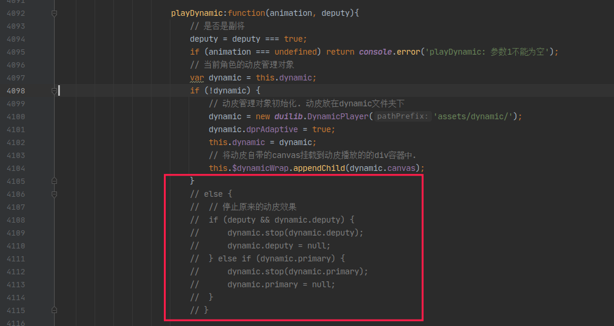

### 皮肤切换使用文档.

#### **说明**

介绍使用文档之前先说明几个问题.

1.  当前扩展只依赖十周年UI, 并且测试都是依赖于`魔改十周年UI2.15`版本之上的, 

   当前扩展理论上不会和修改UI类的其他扩展发生冲突, 只会和依赖于十周年UI的`dynamicWorker.js`

   文件这些操作动皮的扩展发生冲突.

2. 当前这个扩展是把K佬的`EngEX`插件的动皮部分功能抽离进行魔改. 因此可能暂时不和原

来的`EngEX`扩展兼容, 但是当前扩展是支持原来`EngEX`的动态换肤功能与动态皮肤出框攻击的功能的. 

3. 原本取这个扩展的名字为<<`皮肤切换`>>的原因是因为个人想做个动皮静皮切换的功能, 

但是最近(2022-12-1)了解到雷佬已经基于千幻聆音实现了这个功能, 基于不重复造轮子

的思想, 我就不做这个东西了. 

4. 如果导入本扩展导致崩溃报错想要还原, 只要还原十周年UI备份的3个改动文件, 然后删除本扩展即可. 

#### 扩展功能

​	**1. 可视化调整参数**

​	这个扩展当前的功能是能够在游戏中可视化调整动皮的出框和待机参数, 并且保存调整后的参数,

参数的信息保存在插件同级目录的`saveSkinParams.js`, 这里面保存的参数会在加载当前扩展

读取,并覆盖原来十周年UI中`dynamicSkin.js`填写的动皮位置相关参数, 从而实现保存参数的功能. 

如果想要永久修改可以把本地保存的相关参数copy到原来`dynamicSkin.js`. 


如上图所示, 首先打开编辑动皮参数弹窗. 功能分成两栏, 左边为调整动皮待机的参数, 右边为调整动皮出框的参数.

每次要调整对应的参数需要先点击播放待机或者播放出框按钮. 然后下面的修改参数才会生效. 

十周年UI动皮的典型参数如下所示

```js
		武将名:{
			皮肤名:{
				name: "xxx",	//	必★填	骨骼名称，一般是yyy.skel，注意xxx不带后缀名.skel；
				action: "xxx",	//	可删掉	播放动作，xxx 一般是 DaiJi，目前手杀的骨骼文件需要填；
				x: [10, 0.5],	//	可删掉	[10, 0.5]相当于 left: calc(10px + 50%)，不填默认为[0, 0.5]；
				y: [10, 0.5],	//	可删掉	[10, 0.5]相当于 bottom: calc(10px + 50%)，不填默认为[0, 0.5]；
				scale: 0.5,		//	可删掉	缩放大小，不填默认为1；
				angle: 0,		//	可删掉	旋转角度，不填默认为0；
				speed: 1,		//	可删掉	播放速度，不填默认为1；
				hideSlots: ['隐藏的部件'],	// 隐藏不需要的部件，想知道具体部件名称请使用SpineAltasSplit工具查看
				clipSlots: ['裁剪的部件'],	// 剪掉超出头的部件，仅针对露头动皮，其他勿用
				background: "xxx.jpg",	//	可删掉	背景图片，注意后面要写后缀名，如.jpg .png等 
			}
		},
```

当前插件支持修改其中的`x`,`y`,`scale`,`angle`4个参数, 其中出框参数不支持修改角度`angle`, 这两个的实时参数都在调整弹窗有所显示.

点击调整待机或者调整出框会在左侧出现调整位置的十字键, 这是修改上面动皮参数x,y[0, 0.5]右边的比例参数, 弹窗里的x和y的修改是修改x,y[0, 0.5]左边的0px, 这个相当于微调. 参数调整完成点击保存, 保存成功会弹出保存成功的提示.  

**2. 预览spine动画**

如果开启了加入顶部菜单, 可以简单预览一些spine动画, 在这里可以快速查看骨骼的标签, 这个功能是从spine官方的示例demo扒来的,可以查看spine官方库的示例: https://github.com/EsotericSoftware/spine-runtimes/blob/3.8/spine-ts/webgl/example/index.html

上面也有官方更多的spine使用示例. 


要预览这些骨骼只需要把骨骼文件放到扩展目录下的asset文件夹下即可. 可以使用json或者skel格式, 当然骨骼的版本需要无名杀的spine库支持. 

**3. 支持手杀和十周年动皮出框**

要实现上面这种方式, 需要把`dynamicSkin`参数填写正确. 填写示例如下所示. 示例均以何太后为例, 这个角色有假动皮, 手杀真动和十周年真动特效.  可以完整的演示扩展当前支持的出框功能.

参数说明之前一些其他说的. 为了方便管理, 可以在十周年动态骨骼文件夹创建其他文件夹的, 只需要name参数加上完整的文件夹名字就行.


**参数填写详细说明**

```js
// 写法1: 假动皮, 和原来一样该怎么写就怎么写
耀紫迷幻: {
    name: 'skin_hetaihou_YaoZiMiHuan',
    x: [0, 0.5],
    y: [0, 0.5],
    scale: 0.8,
    background: 'skin_hetaihou_YaoZiMiHuan_bg.png',
}


// 写法2: 假动皮如果想要出框的话, 也是支持的. 因为假动皮没有攻击动作, 所以就算出框也只是播放待机动作
耀紫迷幻:{
    name: 'skin_hetaihou_YaoZiMiHuan',
    x: [0, 0.5],
    y: [0, 0.5],
    scale: 0.8,
    background: 'skin_hetaihou_YaoZiMiHuan_bg.png',
    gongji: true  // 假动皮只要在原本的基础上就可以触发攻击特效, 就是在屏幕中央显示待机动作
}
// 写法3: 假动皮想要出框也可以详细的设置, 就像下面一样. 可以配置出框后的待机大小位置等参数
耀紫迷幻:{
    name: 'skin_hetaihou_YaoZiMiHuan',
    x: [0, 0.5],
    y: [0, 0.5],
    scale: 0.8,
    background: 'skin_hetaihou_YaoZiMiHuan_bg.png',
    gongji: {
        name: 'skin_hetaihou_YaoZiMiHuan',  // name可以是其他骨骼皮肤, 不填则默认是当前皮肤
        x: [0, 0.5],
        y: [0, 0.5],
        scale: 0.6,
    }
}

// 手杀真动皮: 写法1, 手杀的真动皮的标签都是ChuKuang, DaiJi, TeShu, GongJi
蛇蝎为心:{
    name: 'skin_hetaihou_SheXieWeiXin',
    action: 'DaiJi', // 现在这个可写可不写, 会自动识别手杀真动皮.
    x: [-50, 0.5],
    y: [10, 0.1],
    scale: 0.46,
    angle: 27,
    clipSlots: ['wangzuo', 'bu2', 'bu3'],
    background: 'skin_hetaihou_SheXieWeiXin_bg.png',
    skinName: '蛇蝎为心',
}
// 手杀真动皮: 写法2, 像下面这种写法是原来EngEX的真动皮写法, 保留这种写法兼容原来的EngEX参数写法.
蛇蝎为心:{
    name: 'skin_hetaihou_SheXieWeiXin',
    action: 'DaiJi', // 现在这个可写可不写, 会自动识别手杀真动皮.
    x: [-50, 0.5],
    y: [10, 0.1],
    scale: 0.46,
    angle: 27,
    pos: {  // 通过pos参数调整出框后的位置参数
        x: [0,0.8],
        y: [0,0.4]
    }
    clipSlots: ['wangzuo', 'bu2', 'bu3'],
    background: 'skin_hetaihou_SheXieWeiXin_bg.png',
    skinName: '蛇蝎为心',
}
// 手杀真动皮: 写法3,  不通过pos参加指定, 统一通过gongji参数来配置
蛇蝎为心:{
    name: 'skin_hetaihou_SheXieWeiXin',
    // action: 'DaiJi',
    x: [-50, 0.5],
    y: [10, 0.1],
    scale: 0.46,
    angle: 27,
    clipSlots: ['wangzuo', 'bu2', 'bu3'],
    background: 'skin_hetaihou_SheXieWeiXin_bg.png',
    skinName: '蛇蝎为心',
    gongji: {  // 指定播放出框攻击的位置大小参数. 
        x: [0, 0.5],
        y: [0, 0.5],
        scale: 0.8,
    }
}

// 十周年UI动皮, 由于十周年UI动皮复杂, 动作都没有统一在一个骨骼文件中. 所以通过下面几种的方式绕过
// 下面的参数解释: 外层还是原来的写法, 不写action会默认寻找骨骼的第一个动作标签当作待机动作.

// teshu动作解释----- 特殊动作是指代当角色使用非攻击的技能时会播放特殊动作.
// teshu标签可以指定同一个皮肤的其他动作, 直接指定名字, 不填默认是手杀的"TeShu", 当然也可以指定其他骨骼文件的某个动作, 当指定
// 其他骨骼文件后, 就是出框动作了, 见teshu写法2

// gongji动作解释----- 当角色使用攻击(比如出杀,南蛮)等会自动触发攻击动作, 也就是下面gongji标签所指代的
// gongji同样可以简写待机骨骼的gongji标签名字,或者可以指定其他骨骼的gongji动画. 所以可以指定其他角色的gongji动画, 虽然很奇怪

// teshu写法1
战场绝版: {
    name: '何太后/daiji',  // 为了方便管理, 可以像这种写法, 把同一个角色的骨骼文件放在一个目录下, 不过name和背景需要指定目录
    x: [0, 1.55],
    y: [0, 0.3],
    scale: 0.45,
    background: '何太后/skin_hetaihou_zhanchangjueban_bg.png',
    teshu: 'play2',  // 如果是和待机同一个皮肤, 可以直接填写对应的特殊动作标签名字
}

// teshu写法2
战场绝版: {
    name: '何太后战场骨骼/daiji',
    x: [0, 1.55],
    y: [0, 0.3],
    scale: 0.45,
    background: '何太后/skin_hetaihou_zhanchangjueban_bg.png',
    teshu: {
        name:"何太后战场骨骼/chuchang2",
        action: 'gongji',
        scale: 0.7,
        x: [0, 0.5],
        y: [0, 0.5],
    }
}

// gongji写法1
战场绝版: {
    name: '何太后战场骨骼/daiji',
    x: [0, 1.55],
    y: [0, 0.3],
    scale: 0.45,
    background: '何太后/skin_hetaihou_zhanchangjueban_bg.png',
    gongji: 'play2',  // 这种简写 攻击会自动寻找待机皮肤的play2标签在屏幕中央播放, x,y是[0,0.5],scale同待机
}


// gongji写法2
战场绝版: {
    name: '何太后战场骨骼/daiji',
    x: [0, 1.55],
    y: [0, 0.3],
    scale: 0.45,
    background: '何太后/skin_hetaihou_zhanchangjueban_bg.png',
    gongji: {  // 这种就是详细写法了
        name:"何太后战场骨骼/chuchang2",  // 可以指定另外的骨骼, 包括其他角色, 只要路径写对. 
        action: 'gongji',  // action不写是默认播放第一个动作
        scale: 0.7,
        x: [0, 0.5],
        y: [0, 0.5],
    }
}
```

#### 十周年文件的修改

因为对十周年UI的文件做了一些修改, 所以要使用需要先导入十周年文件. 需要先备份一下原来的3个文件. 扩展设置页面有提供按钮. 会在原十周年UI目录下创建备份文件夹. 只需要备份一次即可. 

主要只改动`extension.js`, `animiation.js` , `dynamicWorker.js`改动如下.

十周年UI `extension.js`

1 注释了下面的部分



2. 注释了十周年UI的player的初始化方法

 

3 `animiation.js`

改动非常简单.

`APNode`构造方法添加了player参数保存`dynamicSkin.js`的动皮配置参数.


4. `dynamicWorker.js`完全重写


#### 扩展兼容问题

本人测试时使用了特效测试, 手杀UI, 无名杀补丁,原版千幻聆音都没有出现问题. 理论上UI扩展,武将扩展都不会出现兼容问题.

`EngEX扩展暂时还没有适配`

雷佬的千幻聆音雷修版本,个人今天简单使用了下,  已经简单的做了适配, 主要修改千幻聆音`extension.js`的如下部分

因为千幻聆音雷修依赖EngEX扩展的动皮出框, 所以需要替换全局eng的引用. 

需要在扩展的开头加上下面的替换原eng的引用即可. 个人在初步使用这样该没啥问题

第一处: 

```js
let qhly_hasExtension = function (str) {
    if (!str || typeof str != 'string') return false;
    if (lib.config && lib.config.extensions) {
        for (var i of lib.config.extensions) {
            if (i.indexOf(str) == 0) {
                if (lib.config['extension_' + i + '_enable']) return true;
            }
        }
    }
    return false;
};
if (qhly_hasExtension('EngEX')) {
    // window.eng = window.eng
} else if (qhly_hasExtension('皮肤切换')) {
    window.eng = window.skinSwitch
}
```


第二处: 这里是为了解决重复初始化同一角色的问题

```js
if (this.dynamic) {
    if (this.dynamic.primary) this.stopDynamic(true, false)
    if (this.dynamic.deputy) this.stopDynamic(false, true)
    // this.stopDynamic();
}
```


